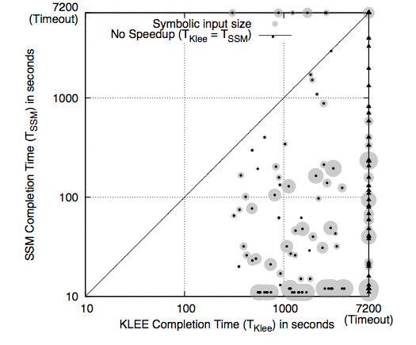
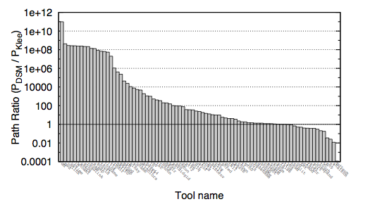

<header>
    <h1>Efficient State Merging in Symbolic Execution</h1>
    <h2>Volodymyr Kuznetsov,
        Johannes Kinder, Stefan Bucur, George Candea</h2>
    <h2>Dependable Systems Lab, EPFL</h2>
    

</header>

Symbolic execution is a practical technique lying at the core of multiple
automated test case generation, bug finding and program analysis tools. It
by unfurling a program into an execution tree:


if (x) {
    ...
}
if (y) {
    ...
}


  <pre>
                o
               / \
   --->       o   o
             / \ / \
            o  o o  o
  </pre>

For large programs, this tree becomes really big. State merging is a technique
that compresses this tree by merging some of the forked paths back:

  <pre>
                o
               / \
              o   o
             / \ / \
            o  o o  o
  </pre>

  <pre>
                o
               { }
   --->         o
               { }
                o
  </pre>

The result is an significant speedup in time it takes to complete symbolic
execution:


Alternatively, symbolic execution with state merging can analyze up to 10^11
more paths:



### Publications

[Efficient State Merging in Symbolic Execution.](http://dslab.epfl.ch/pubs/stateMerging.pdf?attredirects=0)
Volodymyr Kuznetsov, Johannes Kinder, Stefan Bucur, and George Candea.
Conference on Programming Language Design and Implementation ([PLDI](http://pldi12.cs.purdue.edu/)), Beijing, China, June 2012

### Downloads

- [Cloud9-based prototype](https://s3.amazonaws.com/static.cloud9.epfl.ch/cloud9-state-merging-pldi12.tar.bz2)
- [PLDI paper experimental data](https://s3.amazonaws.com/static.cloud9.epfl.ch/state-merging-expdata-pldi12.tar.bz2)